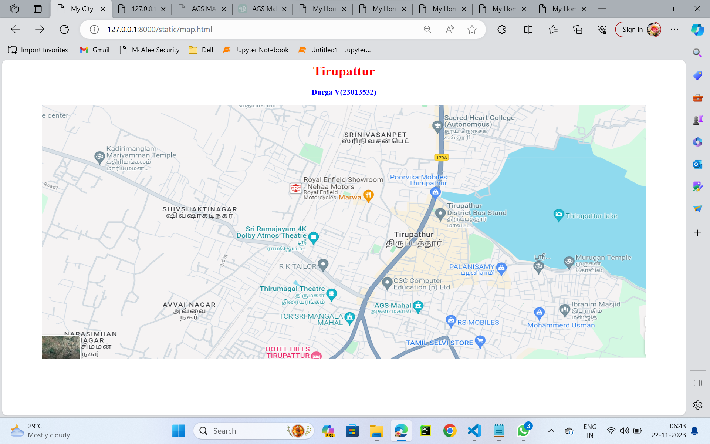
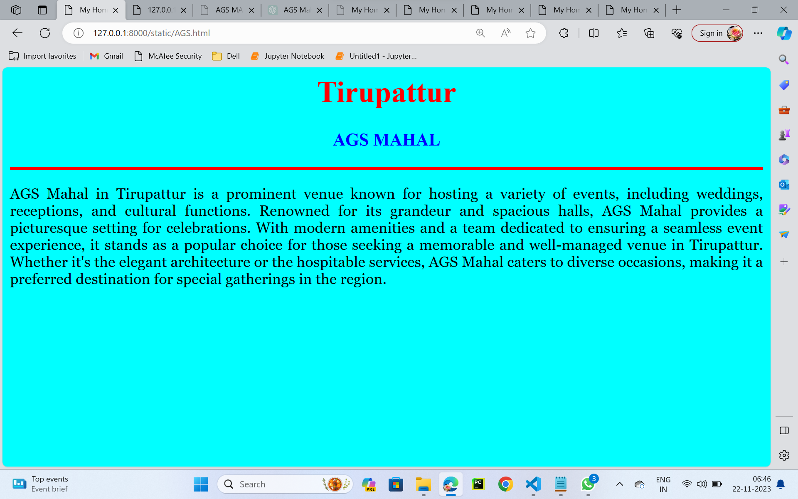
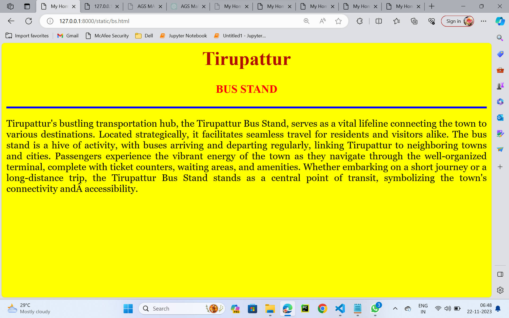
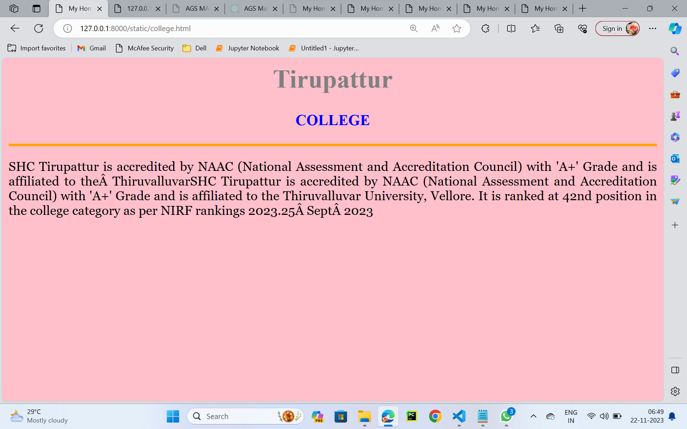
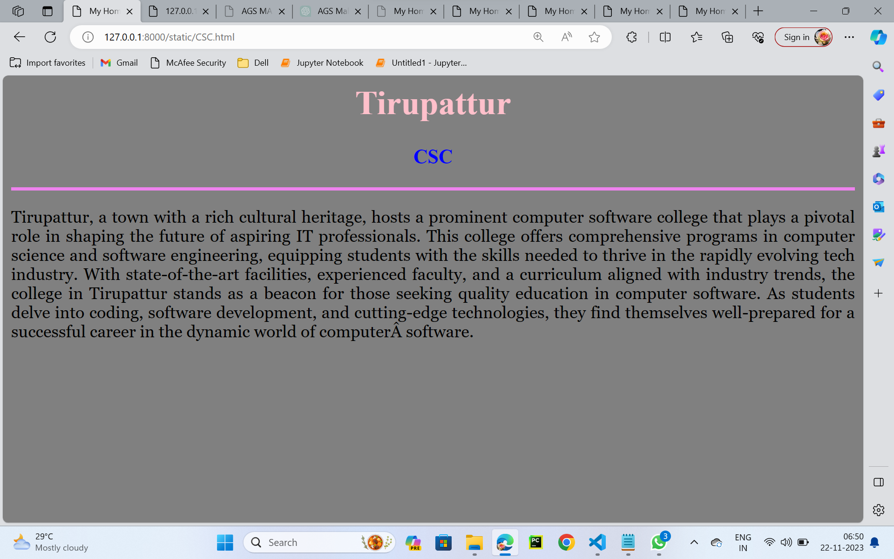
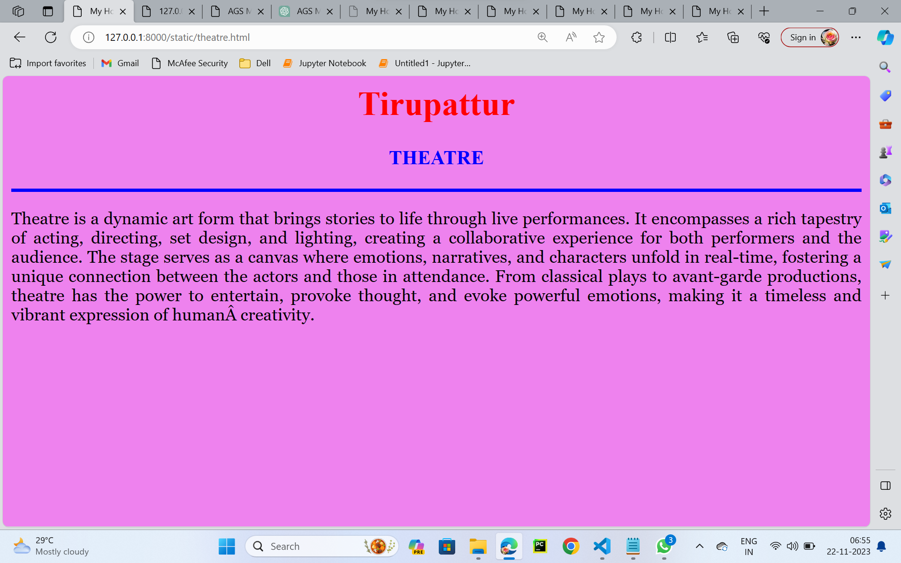

# Ex04 Places Around Me
## Date:22.11.2023

## AIM
To develop a website to display details about the places around my house.

## DESIGN STEPS

### STEP 1
Create a Django admin interface.

### STEP 2
Download your city map from Google.

### STEP 3
Using ```<map>``` tag name the map.

### STEP 4
Create clickable regions in the image using ```<area>``` tag.

### STEP 5
Write HTML programs for all the regions identified.

### STEP 6
Execute the programs and publish them.

## CODE
```
map.html

<html>
<head>
<title>My City</title>
</head>
<body>
<h1 align="Center">
<font color="red"><b>Tirupattur</b></font>
</h1>
<h3 align="center">
<font color="blue"><b>Durga V(23013532)</b></font>
</h3>
<center>

<map name="MyCity">
<area shape="rect" coords="850,450,900,500" href="AGS.html" title="AGS Mahal">
<area shape="rect" coords="800,400,950,500" href="CSC.html" title="CSC">
<area shape="rect" coords="950,200,1000,450" href="bs.html" title="BUS STAND">
<area shape="rect" coords="950,50,1000,100" href="college.html" title="COLLEGE">
<area shape="rect" coords="650,400,800,500" href="theatre.html" title="THEATRE">
</map>
</center>
</body>
</html>

AGS.HTML

<html>
<head>
<title>My Home Town</title>
</head>
<body bgcolor="CYAN">
<h1 align="center">
<font color="red"><b>Tirupattur</b></font>
</h1>
<h3 align="center">
<font color="blue"><b>AGS MAHAL</b></font>
</h3>
<hr size="3" color="red">
<p align="justify">
<font face="Georgia" size="s">
AGS Mahal in Tirupattur is a prominent venue known for hosting a variety of events,
 including weddings, receptions, and cultural functions. Renowned for its grandeur 
 and spacious halls, AGS Mahal provides a picturesque setting for celebrations. With
  modern amenities and a team dedicated to ensuring a seamless event experience, it 
  stands as a popular choice for those seeking a memorable and well-managed venue in 
  Tirupattur. Whether it's the elegant architecture or the hospitable services, 
  AGS Mahal caters to diverse occasions, making it a preferred destination for special
  gatherings in the region.
</font>
</p>
</body>
</html>

bs.html

<html>
<head>
<title>My Home Town</title>
</head>
<body bgcolor="yellow">
<h1 align="center">
<font color="blues"><b>Tirupattur</b></font>
</h1>
<h3 align="center">
<font color="red"><b>BUS STAND</b></font>
</h3>
<hr size="3" color="blue">
<p align="justify">
<font face="Georgia" size="s">
Tirupattur's bustling transportation hub, the Tirupattur Bus Stand, serves as a vital lifeline connecting the town to various destinations. Located strategically, it facilitates seamless travel for residents and visitors alike. The bus stand is a hive of activity, with buses arriving and departing regularly, linking Tirupattur to neighboring towns and cities. Passengers experience the vibrant energy of the town as they navigate through the well-organized terminal, complete with ticket counters, waiting areas, and amenities. Whether embarking on a short journey or a long-distance trip, the Tirupattur Bus Stand stands as a central point of transit, symbolizing the town's connectivity and accessibility.
</font>
</p>
</body>
</html>

college.html

<html>
<head>
<title>My Home Town</title>
</head>
<body bgcolor="pink">
<h1 align="center">
<font color="grey"><b>Tirupattur</b></font>
</h1>
<h3 align="center">
<font color="blue"><b>COLLEGE</b></font>
</h3>
<hr size="3" color="orange">
<p align="justify">
<font face="Georgia" size="s">
SHC Tirupattur is accredited by NAAC (National Assessment and Accreditation Council) with 'A+' Grade and is affiliated to the ThiruvalluvarSHC Tirupattur is accredited by NAAC (National Assessment and Accreditation Council) with 'A+' Grade and is affiliated to the Thiruvalluvar University, Vellore. It is ranked at 42nd position in the college category as per NIRF rankings 2023.25 Sept 2023
</font>
</p>
</body>
</html>

CSC.html

<html>
<head>
<title>My Home Town</title>
</head>
<body bgcolor="grey">
<h1 align="center">
<font color="pink"><b>Tirupattur</b></font>
</h1>
<h3 align="center">
<font color="blue"><b>CSC</b></font>
</h3>
<hr size="3" color="violet">
<p align="justify">
<font face="Georgia" size="s">
Tirupattur, a town with a rich cultural heritage, hosts a prominent computer software college that plays a pivotal role in shaping the future of aspiring IT professionals. This college offers comprehensive programs in computer science and software engineering, equipping students with the skills needed to thrive in the rapidly evolving tech industry. With state-of-the-art facilities, experienced faculty, and a curriculum aligned with industry trends, the college in Tirupattur stands as a beacon for those seeking quality education in computer software. As students delve into coding, software development, and cutting-edge technologies, they find themselves well-prepared for a successful career in the dynamic world of computer software.
</font>
</p>
</body>
</html>

theatre.html

<html>
<head>
<title>My Home Town</title>
</head>
<body bgcolor="violet">
<h1 align="center">
<font color="red"><b>Tirupattur</b></font>
</h1>
<h3 align="center">
<font color="blue"><b>THEATRE</b></font>
</h3>
<hr size="3" color="blue">
<p align="justify">
<font face="Georgia" size="s">
Theatre is a dynamic art form that brings stories to life through live performances. It encompasses a rich tapestry of acting, directing, set design, and lighting, creating a collaborative experience for both performers and the audience. The stage serves as a canvas where emotions, narratives, and characters unfold in real-time, fostering a unique connection between the actors and those in attendance. From classical plays to avant-garde productions, theatre has the power to entertain, provoke thought, and evoke powerful emotions, making it a timeless and vibrant expression of human creativity.
</font>
</p>
</body>
</html>

```


## OUTPUT








## RESULT
The program for implementing image maps using HTML is executed successfully.
